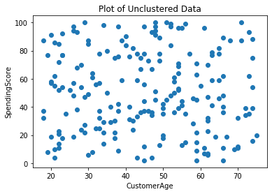
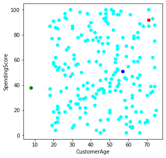
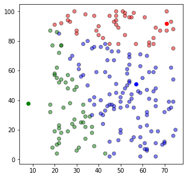
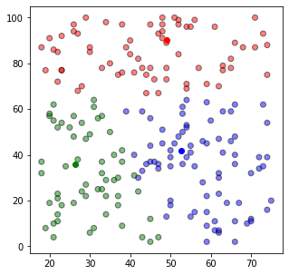
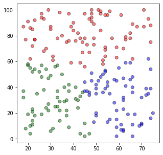
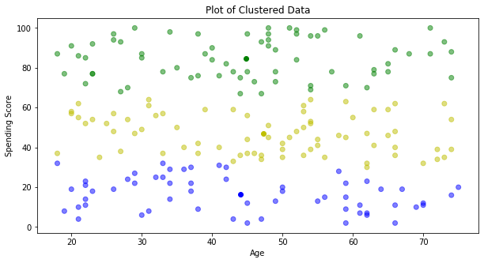
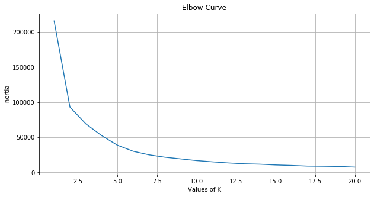

# K-Means-Clustering
Unsupervised learning - exclusive clustering

This is an algorithm to create exclusive clusters. 

**Mathematical Intuition and Notes**

Mathematically expressed as:
* Let C1, C2, Ck be the K clusters
* Then we can write: $C_1 U C_2 UC_3 U…UC_k $={1,2,3,…,n} i.e., each datapoint has been assigned to a cluster.
* The idea behind the K-Means clustering approach is that the within-cluster variation amongst the point should be minimum. The within-cluster variance is denoted by: W(Ck).Hence, according to the statement above, we need to  minimize this variance for all the clusters. 
* The next step  is to define the criterion for measuring the within-cluster variance. Generally, the criterion is the Euclidean distance between two data points.
* The above formula says that we are calculating the distances between all the point in a cluster, then we are repeating it for all the K clusters(That’s why two summation signs) and then we are dividing it by the number of observation in the clusters (Ck is the number of observations in the Kth cluster) to calculate the average.

So, ultimately our goal is to minimize the distance of 'tagged' data points from the centroids. 

The following algorithm steps are used to solve this problem.

**Algorithm**

1. Randomly assign K cluster centers. We make sure that these are very distant from each other. 
2. Calculate the distance of all the data points from all the K number of centers and allocate the points to the cluster based on the shortest distance. The model's *inertia* is the mean squared distance between each instance and its closest Kth point. The K points are also called **centroids** which we have randomly selected in step 1. Our goal is the have a model with lowest inertia. 
3. Recompute the centroids (location) once all points are assigned to the nearby Kth centroid. 
4. Repeat steps 2 and 3, until the locations of the centroid strop changing and the cluster allocation of the points become constant! 

**Upfront problems**

1. How to choose right value for K? **ANS = ELBOW METHOD** 
2. How to make it performance friendly? **ANS = K-Means++**

###### The Elbow-Method

This method is based on the relationship between the within-cluster sum of squared distances(WCSS Or Inertia) and the number of clusters. It is observed that first with an increase in the number of clusters WCSS decreases steeply and then after a certain number of clusters the drop in WCSS is not that prominent. The point after which the graph between WCSS and the number of clusters becomes comparatively smother is termed as the elbow and the number of cluster at that point are the optimum number of clusters as even after increasing the clusters after that point the variation is not decreasing by much i.e., we have accounted for almost all the dissimilarity in the data.

###### Challenges and improvements in K-Means:

1.	We need to specify the number of clusters beforehand.
2.	It is required to run the algorithm multiple times to avoid a sub-optimal solution
3.	K-Means does not behave very well when the clusters have varying sizes, different densities, or non-spherical shapes.
4.	The clusters sometimes vary based on the initial choice of the centroids. An important improvement to the K-Means algorithm, called **K-Means++**, was proposed in a _2006 paper by David Arthur and Sergei Vassilvitskii_. They introduced a smarter initialization step that tends to select centroids that are distant from one another, and this makes the K-Means algorithm much less likely to converge to a suboptimal solution.
5.	Another important improvement to the K-Means algorithm was proposed in a _2003 paper by Charles Elkan_.It considerably accelerates the algorithm by avoiding many unnecessary distance calculations: this is achieved by exploiting the _triangle inequality_ (i.e., the straight line is always the shortest; in a triangle with sides a,b and c=> **a+b>c**) and by keeping track of lower and upper bounds for distances between instances and centroids. 
6.	Yet another important variant of the K-Means algorithm was proposed in a _2010 paper by David Sculley_. Instead of using the full dataset at each iteration, the algorithm is capable of using **mini-batches**, moving the centroids just slightly at each iteration. This speeds up the algorithm typically by a factor of 3 or 4 and makes it possible to cluster huge datasets that do not fit in memory. Scikit-Learn implements this algorithm in the **MiniBatchKMeans** class. You can just use this class like the KMeans class

#**Demo: K-Means Clustering Using Python**

###**Problem Definition**

Perform K-Means Clustering on a dataset containing shopping details of customers from various cities to understand how clustering segregates the data similar to each other.


###**Dataset Description**

The dataset is based on the the shopping details of customers of few cities. The data has been populated randomly and holds no such relation to any real systems data or confidential data. It has 8 dimensions or features with 200 entries.

The Attributes are:

>* CustomerID
>* CustomerGender
>* CustomerAge
>* CustomerCity
>* AnnualIncome
>* CreditScore
>* SpendingScore
>* CustomerCityID

###**Tasks to be performed**


>* Importing Required Libraries
>* Analyzing the data
>* Understanding K-Means
>* Implementing K-Means from Scratch
>* Implementing K-Means using sklearn library 

###**Importing Required Libraries**


```
import pandas as pd
import numpy as np
import matplotlib.pyplot as plt
from sklearn.model_selection import train_test_split
from sklearn.cluster import KMeans
from sklearn.metrics import accuracy_score,confusion_matrix
import warnings
warnings.filterwarnings("ignore")
```


```
df1 = pd.read_csv('./Shopping_CustomerData.csv')
df1.head()
```


<div>
<table border="1" class="dataframe">
  <thead>
    <tr style="text-align: right;">
      <th></th>
      <th>CustomerID</th>
      <th>CustomerGender</th>
      <th>CustomerAge</th>
      <th>CustomerCity</th>
      <th>AnnualIncome</th>
      <th>CreditScore</th>
      <th>SpendingScore</th>
      <th>CustomerCityID</th>
    </tr>
  </thead>
  <tbody>
    <tr>
      <th>0</th>
      <td>1001</td>
      <td>Male</td>
      <td>49</td>
      <td>Bengaluru</td>
      <td>527547.58850</td>
      <td>653</td>
      <td>78</td>
      <td>1</td>
    </tr>
    <tr>
      <th>1</th>
      <td>1002</td>
      <td>Male</td>
      <td>59</td>
      <td>Bengaluru</td>
      <td>207143.19760</td>
      <td>630</td>
      <td>63</td>
      <td>1</td>
    </tr>
    <tr>
      <th>2</th>
      <td>1003</td>
      <td>Female</td>
      <td>54</td>
      <td>Delhi</td>
      <td>164423.84570</td>
      <td>555</td>
      <td>69</td>
      <td>4</td>
    </tr>
    <tr>
      <th>3</th>
      <td>1004</td>
      <td>Female</td>
      <td>42</td>
      <td>Bengaluru</td>
      <td>56220.36443</td>
      <td>699</td>
      <td>30</td>
      <td>1</td>
    </tr>
    <tr>
      <th>4</th>
      <td>1005</td>
      <td>Female</td>
      <td>30</td>
      <td>Bengaluru</td>
      <td>256194.36190</td>
      <td>793</td>
      <td>6</td>
      <td>1</td>
    </tr>
  </tbody>
</table>
</div>


####**Analyzing the Data**


```
#Here, we will take only two features and top 400 entries of each feature from the dataset just to make it easy to visualize the steps.
df_new = df1[["CustomerAge","SpendingScore"]]
df_new.head()

```


<div>

<table border="1" class="dataframe">
  <thead>
    <tr style="text-align: right;">
      <th></th>
      <th>CustomerAge</th>
      <th>SpendingScore</th>
    </tr>
  </thead>
  <tbody>
    <tr>
      <th>0</th>
      <td>49</td>
      <td>78</td>
    </tr>
    <tr>
      <th>1</th>
      <td>59</td>
      <td>63</td>
    </tr>
    <tr>
      <th>2</th>
      <td>54</td>
      <td>69</td>
    </tr>
    <tr>
      <th>3</th>
      <td>42</td>
      <td>30</td>
    </tr>
    <tr>
      <th>4</th>
      <td>30</td>
      <td>6</td>
    </tr>
  </tbody>
</table>
</div>


```
df_new.describe()
```


<div>
<table border="1" class="dataframe">
  <thead>
    <tr style="text-align: right;">
      <th></th>
      <th>CustomerAge</th>
      <th>SpendingScore</th>
    </tr>
  </thead>
  <tbody>
    <tr>
      <th>count</th>
      <td>200.000000</td>
      <td>200.00000</td>
    </tr>
    <tr>
      <th>mean</th>
      <td>45.520000</td>
      <td>50.70500</td>
    </tr>
    <tr>
      <th>std</th>
      <td>16.113592</td>
      <td>28.72269</td>
    </tr>
    <tr>
      <th>min</th>
      <td>18.000000</td>
      <td>2.00000</td>
    </tr>
    <tr>
      <th>25%</th>
      <td>31.750000</td>
      <td>27.75000</td>
    </tr>
    <tr>
      <th>50%</th>
      <td>46.500000</td>
      <td>48.00000</td>
    </tr>
    <tr>
      <th>75%</th>
      <td>59.000000</td>
      <td>77.00000</td>
    </tr>
    <tr>
      <th>max</th>
      <td>75.000000</td>
      <td>100.00000</td>
    </tr>
  </tbody>
</table>
</div>


```
#Checking for Null Values
df_new.isnull().sum()
```


    CustomerAge      0
    SpendingScore    0
    dtype: int64


**Lets plot these two variables and visualize them**


```
plt.scatter(df_new.iloc[:,0],df_new.iloc[:,1])
plt.xlabel('CustomerAge')
plt.ylabel('SpendingScore')
plt.title('Plot of Unclustered Data')
plt.show()

```


    

    


**From above, you can see the unclustered data**


**Implementing K-Means from Scratch**

**Stopping Criteria**
We stop the K-Means Clustering Algorithm **when the centroids of the clusters are not changing at all even after multiple iterations. That means the algorithm is not finding any new patterns.**

The algorithm will stop the training **once the maximum number of iterations has reached. For example - if you set the maximum number of iterations as 30, the algorithm will stop after 30 iterations.**


```
#Step-1
k = 3#Assuming the value of k to be 3
np.random.seed(40)

#Here, we are selecting three points randomly as centroids 
random_centroids=[]
for i in range(1,k+1):
  random_centroids.append([np.random.randint(1,100), np.random.randint(1,100)])#Here, we have selecting the random values between 1 and 100 because most of of our values lie in this range
print('Randomly selected points as random_centroids:',random_centroids)

```

    Randomly selected points as random_centroids: [[71, 92], [8, 38], [57, 51]]
    


```
#Here, we are plotting the random_centroids that we selected previously
plt.figure(figsize=(5, 5))
plt.scatter(df_new.iloc[:,0], df_new.iloc[:,1], color='cyan')
length = len(random_centroids)
colors1=['r','g','b','cyan','yellow','black']
for i in range(length):
  plt.scatter(*random_centroids[i],color=colors1[i])
plt.xlabel('CustomerAge')
plt.ylabel('SpendingScore')
plt.show()

```


    

    


```
#Step-2

#Here, we are calculating the distance between the datapoints and our centroids and assigning each data-point to the closest cluster
 def assignment(df_new,random_centroids):

  for i in range(length) :
    df_new['Distance from Centroid {}'.format(i)]=(np.sqrt((df_new.iloc[:,0] - random_centroids[i][0]) ** 2 + (df_new.iloc[:,1] - random_centroids[i][1]) ** 2))
   
  list1=[]
  list2=[]
  for a,b,c in zip(df_new['Distance from Centroid 0'],df_new['Distance from Centroid 1'],df_new['Distance from Centroid 2']):
    d = min(a,b,c)
   
    if d == a:
      list1.append(0)
      list2.append('r')
    elif d == b:
      list1.append(1)
      list2.append('g')
    else:
      list1.append(2)
      list2.append('b')
  df_new['Closest_Centroid'] = list1
  df_new['Color']=list2
  return df_new 
```


```
df_new = assignment(df_new, random_centroids)
df_new.head()
```


<div>

<table border="1" class="dataframe">
  <thead>
    <tr style="text-align: right;">
      <th></th>
      <th>CustomerAge</th>
      <th>SpendingScore</th>
      <th>Distance from Centroid 0</th>
      <th>Distance from Centroid 1</th>
      <th>Distance from Centroid 2</th>
      <th>Closest_Centroid</th>
      <th>Color</th>
    </tr>
  </thead>
  <tbody>
    <tr>
      <th>0</th>
      <td>49</td>
      <td>78</td>
      <td>26.076810</td>
      <td>57.280014</td>
      <td>28.160256</td>
      <td>0</td>
      <td>r</td>
    </tr>
    <tr>
      <th>1</th>
      <td>59</td>
      <td>63</td>
      <td>31.384710</td>
      <td>56.797887</td>
      <td>12.165525</td>
      <td>2</td>
      <td>b</td>
    </tr>
    <tr>
      <th>2</th>
      <td>54</td>
      <td>69</td>
      <td>28.600699</td>
      <td>55.470713</td>
      <td>18.248288</td>
      <td>2</td>
      <td>b</td>
    </tr>
    <tr>
      <th>3</th>
      <td>42</td>
      <td>30</td>
      <td>68.447060</td>
      <td>34.928498</td>
      <td>25.806976</td>
      <td>2</td>
      <td>b</td>
    </tr>
    <tr>
      <th>4</th>
      <td>30</td>
      <td>6</td>
      <td>95.273291</td>
      <td>38.832976</td>
      <td>52.478567</td>
      <td>1</td>
      <td>g</td>
    </tr>
  </tbody>
</table>
</div>


```
#Plotting the clusters
plt.figure(figsize=(5,5))
plt.scatter(df_new.iloc[:,0],df_new.iloc[:,1],color =df_new['Color'],alpha = 0.5,edgecolor = 'k')
for i in range(length):
  plt.scatter(*random_centroids[i],color=colors1[i])

```


    

    


```
#Step-3

#Update Stage
#In this satge, we are updating the centroids of the newly formed clusters
def update(parameter):
    for i in range(length):
        random_centroids[i][0] = np.mean(df_new[df_new['Closest_Centroid'] == i]['CustomerAge'])
        random_centroids[i][1] = np.mean(df_new[df_new['Closest_Centroid'] == i]['SpendingScore'])
    return parameter
```


```
random_centroids = update(random_centroids)
random_centroids
```


    [[49.16279069767442, 90.09302325581395],
     [26.387755102040817, 35.97959183673469],
     [52.75, 41.7037037037037]]


```
#Repeat Assignment Step
#Here, we are again calculating the distance between the datapoints and our centroids and assigning each data-point to the closest cluster
df_new = assignment(df_new, random_centroids)  
df_new.head()
plt.figure(figsize=(5, 5))
plt.scatter(df_new.iloc[:,0], df_new.iloc[:,1], color=df_new['Color'], alpha=0.5, edgecolor='k')
for i in range(length):
  plt.scatter(*random_centroids[i], color=colors1[i])
plt.show()
```


    

    


```
#Step-4

#In this step, we are going to keep repeating the update centroid and the assignment stage until the centroids stop changing i.e. No New Clusters being formed.
count=1
while True:
  old_random_centroids = np.round(random_centroids)
  print('Old Centroid',old_random_centroids)
  count+=1
  random_centroids = update(random_centroids)
  
  new_random_centroids = np.round(random_centroids)
  print('New Centroid',new_random_centroids)

  df_new = assignment(df_new, random_centroids)
  result=np.allclose(old_random_centroids,new_random_centroids)#np.allclose() function checks if two arrays are equal element-wise
  print(result)
  if result == True:
    break
  
    
print(count)

```

    Old Centroid [[49. 90.]
     [26. 36.]
     [53. 42.]]
    New Centroid [[45. 85.]
     [30. 32.]
     [58. 35.]]
    False
    Old Centroid [[45. 85.]
     [30. 32.]
     [58. 35.]]
    New Centroid [[45. 82.]
     [30. 31.]
     [59. 33.]]
    False
    Old Centroid [[45. 82.]
     [30. 31.]
     [59. 33.]]
    New Centroid [[45. 82.]
     [31. 30.]
     [60. 32.]]
    False
    Old Centroid [[45. 82.]
     [31. 30.]
     [60. 32.]]
    New Centroid [[45. 81.]
     [31. 30.]
     [60. 32.]]
    False
    Old Centroid [[45. 81.]
     [31. 30.]
     [60. 32.]]
    New Centroid [[45. 81.]
     [31. 30.]
     [60. 32.]]
    True
    6
    


```
plt.figure(figsize=(5, 5))
plt.scatter(df_new.iloc[:,0], df_new.iloc[:,1], color=df_new['Color'], alpha=0.5, edgecolor='k')
plt.show()
```


    

    


####**Implementing K-Means using scikit learn**


```
#Here, we will take only two features and top 400 entries of each feature from the dataset just to make it easy to visualize the steps.
df = df1[["CustomerAge","SpendingScore"]]
df.head()

```


<div>

<table border="1" class="dataframe">
  <thead>
    <tr style="text-align: right;">
      <th></th>
      <th>CustomerAge</th>
      <th>SpendingScore</th>
    </tr>
  </thead>
  <tbody>
    <tr>
      <th>0</th>
      <td>49</td>
      <td>78</td>
    </tr>
    <tr>
      <th>1</th>
      <td>59</td>
      <td>63</td>
    </tr>
    <tr>
      <th>2</th>
      <td>54</td>
      <td>69</td>
    </tr>
    <tr>
      <th>3</th>
      <td>42</td>
      <td>30</td>
    </tr>
    <tr>
      <th>4</th>
      <td>30</td>
      <td>6</td>
    </tr>
  </tbody>
</table>
</div>


```
#Here, we are assuming the value of k as 5
kmeans = KMeans(n_clusters=3)#Creating a K-Means Object
kmeans.fit(df)#Fitting the Model
```


    KMeans(algorithm='auto', copy_x=True, init='k-means++', max_iter=300,
           n_clusters=3, n_init=10, n_jobs=None, precompute_distances='auto',
           random_state=None, tol=0.0001, verbose=0)


```
#Here, we are generating Labels of each point
labels = kmeans.predict(df)
labels
```


    array([1, 0, 1, 2, 2, 1, 2, 1, 2, 1, 2, 0, 0, 2, 0, 0, 2, 0, 1, 1, 1, 0,
           1, 0, 1, 1, 0, 0, 2, 0, 2, 1, 1, 2, 0, 0, 1, 1, 1, 1, 2, 1, 0, 2,
           1, 0, 1, 0, 1, 0, 0, 0, 0, 0, 1, 1, 0, 1, 2, 2, 0, 2, 0, 0, 0, 2,
           1, 0, 0, 1, 0, 2, 1, 2, 0, 1, 1, 2, 2, 0, 0, 0, 1, 0, 2, 0, 1, 0,
           2, 0, 0, 0, 2, 0, 0, 0, 2, 1, 1, 2, 2, 2, 2, 0, 0, 0, 0, 1, 0, 1,
           2, 1, 0, 2, 1, 2, 2, 2, 1, 2, 1, 1, 2, 1, 2, 0, 0, 1, 1, 1, 0, 2,
           1, 1, 0, 1, 1, 0, 2, 2, 2, 2, 2, 2, 1, 2, 0, 2, 2, 1, 1, 0, 1, 0,
           0, 0, 2, 1, 0, 1, 0, 1, 2, 1, 2, 0, 1, 1, 0, 1, 0, 0, 0, 1, 1, 2,
           1, 2, 2, 0, 0, 1, 1, 0, 2, 0, 1, 2, 0, 2, 1, 0, 2, 0, 1, 0, 0, 0,
           2, 2], dtype=int32)


```
#printing the centroids of each cluster
centroids = kmeans.cluster_centers_
centroids
```


    array([[47.26666667, 46.82666667],
           [44.82089552, 84.65671642],
           [44.06896552, 16.5       ]])


```
#Sum of squared distances of data-points to their closest cluster center. It tells us how well the formed clusters are
kmeans.inertia_
```


    69240.59269514497


###**Let's visualize the Clustered Data**


```
plt.figure(figsize=(10, 5))
colmap = {1:'y',2:'g',3:'b',4:'r',5:'c'}
colors = map(lambda x: colmap[x+1], labels)
print(colors)
colors1=list(colors)

plt.scatter(df['CustomerAge'], df['SpendingScore'], color=colors1, alpha=0.5)
for idx, centroid in enumerate(centroids):
    plt.scatter(*centroid, color=colmap[idx+1])
plt.xlabel('Age')
plt.ylabel('Spending Score')
plt.title('Plot of Clustered Data')
plt.show()
```

    <map object at 0x7f6626e86400>
    


    

    


###**How to determine the value of K?**

>* If we know how many classes we want to classify, then we use that value as 'k'. For Example - All of us have heard of the Iris data or even worked with it earlier. It has three classes we could classify our flowers into. So, in that case the value of k could be taken as 3.
>* If we don't know how many classes we want, then we will have to decide what the best 'k' value is. A very popular to find the value of 'k' is **Elbow Method**

###**Elbow Method**


```
inertia_list = []
for num_clusters in np.arange(1, 21):
    kmeans =KMeans(n_clusters=num_clusters)
    kmeans.fit(df)
    inertia_list.append(kmeans.inertia_)
```


```
inertia_list
```


    [215843.515,
     93076.96095008052,
     69228.85879694519,
     52510.21384913898,
     38785.428706963765,
     30111.447935988363,
     25034.331104658668,
     21666.294699374703,
     19248.411694693114,
     16850.494389978216,
     15072.98511578179,
     13503.942673584585,
     12285.915581876845,
     11712.149767863491,
     10626.60641063443,
     9927.96220242176,
     8973.745950282948,
     8778.219380782617,
     8449.319964186141,
     7539.279273504274]


```
#Plotting the Elbow Curve
plt.figure(figsize=(10, 5))
plt.plot(np.arange(1, 21), inertia_list)
plt.grid(True)
plt.xlabel('Values of K')
plt.ylabel('Inertia')
plt.title('Elbow Curve')
plt.show()
```


    

    


**From above, we select the optimum value of k by determining the Elbow Point - a point after which the inertia starts decreasing linearly. In this case, we can select the value of k as 10.**


```

```
