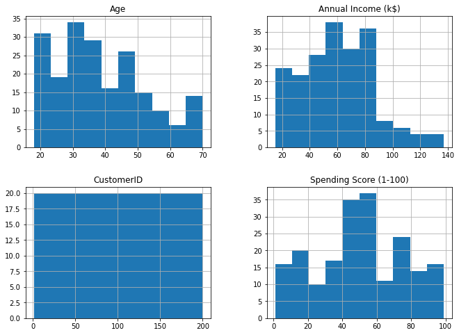
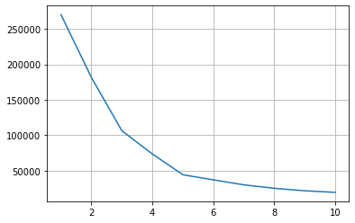
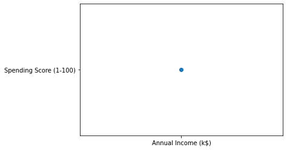
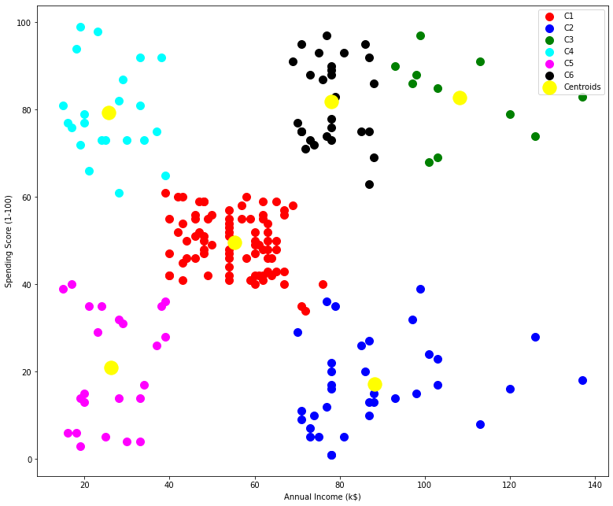

# K-Means-Clustering
Unsupervised learning - exclusive clustering

This is an algorithm to create exclusive clusters. 

**Mathematical Intuition and Notes**

Mathematically expressed as:
* Let C1, C2, Ck be the K clusters
* Then we can write: $C_1 U C_2 UC_3 U…UC_k $={1,2,3,…,n} i.e., each datapoint has been assigned to a cluster.
* The idea behind the K-Means clustering approach is that the within-cluster variation amongst the point should be minimum. The within-cluster variance is denoted by: W(Ck).Hence, according to the statement above, we need to  minimize this variance for all the clusters. 
* The next step  is to define the criterion for measuring the within-cluster variance. Generally, the criterion is the Euclidean distance between two data points.
* The above formula says that we are calculating the distances between all the point in a cluster, then we are repeating it for all the K clusters(That’s why two summation signs) and then we are dividing it by the number of observation in the clusters (Ck is the number of observations in the Kth cluster) to calculate the average.

So, ultimately our goal is to minimize the distance of 'tagged' data points from the centroids. 

The following algorithm steps are used to solve this problem.

**Algorithm**

1. Randomly assign K cluster centers. We make sure that these are very distant from each other. 
2. Calculate the distance of all the data points from all the K number of centers and allocate the points to the cluster based on the shortest distance. The model's *inertia* is the mean squared distance between each instance and its closest Kth point. The K points are also called **centroids** which we have randomly selected in step 1. Our goal is the have a model with lowest inertia. 
3. Recompute the centroids (location) once all points are assigned to the nearby Kth centroid. 
4. Repeat steps 2 and 3, until the locations of the centroid strop chanding and the cluster allocation of the points become constant! 

**Upfront problems**

1. How to choose right value for K? **ANS = ELBOW METHOD** 
2. How to make it performance friendly? **ANS = K-Means++**

###### The Elbow-Method

This method is based on the relationship between the within-cluster sum of squared distances(WCSS Or Inertia) and the number of clusters. It is observed that first with an increase in the number of clusters WCSS decreases steeply and then after a certain number of clusters the drop in WCSS is not that prominent. The point after which the graph between WCSS and the number of clusters becomes comparatively smother is termed as the elbow and the number of cluster at that point are the optimum number of clusters as even after increasing the clusters after that point the variation is not decreasing by much i.e., we have accounted for almost all the dissimilarity in the data.

###### Challenges and improvements in K-Means:

1.	We need to specify the number of clusters beforehand.
2.	It is required to run the algorithm multiple times to avoid a sub-optimal solution
3.	K-Means does not behave very well when the clusters have varying sizes, different densities, or non-spherical shapes.
4.	The clusters sometimes vary based on the initial choice of the centroids. An important improvement to the K-Means algorithm, called **K-Means++**, was proposed in a _2006 paper by David Arthur and Sergei Vassilvitskii_. They introduced a smarter initialization step that tends to select centroids that are distant from one another, and this makes the K-Means algorithm much less likely to converge to a suboptimal solution.
5.	Another important improvement to the K-Means algorithm was proposed in a _2003 paper by Charles Elkan_.It considerably accelerates the algorithm by avoiding many unnecessary distance calculations: this is achieved by exploiting the _triangle inequality_ (i.e., the straight line is always the shortest; in a triangle with sides a,b and c=> **a+b>c**) and by keeping track of lower and upper bounds for distances between instances and centroids. 
6.	Yet another important variant of the K-Means algorithm was proposed in a _2010 paper by David Sculley_. Instead of using the full dataset at each iteration, the algorithm is capable of using **mini-batches**, moving the centroids just slightly at each iteration. This speeds up the algorithm typically by a factor of 3 or 4 and makes it possible to cluster huge datasets that do not fit in memory. Scikit-Learn implements this algorithm in the **MiniBatchKMeans** class. You can just use this class like the KMeans class


```python
import pandas as pd
```


```python
import numpy as np
```


```python
import matplotlib.pyplot as plt
```


```python
%matplotlib inline
```


```python
dataset = pd.read_csv('Mall_Customers.csv')
```


```python
dataset.head()
```


<div>
<table border="1" class="dataframe">
  <thead>
    <tr style="text-align: right;">
      <th></th>
      <th>CustomerID</th>
      <th>Genre</th>
      <th>Age</th>
      <th>Annual Income (k$)</th>
      <th>Spending Score (1-100)</th>
    </tr>
  </thead>
  <tbody>
    <tr>
      <th>0</th>
      <td>1</td>
      <td>Male</td>
      <td>19</td>
      <td>15</td>
      <td>39</td>
    </tr>
    <tr>
      <th>1</th>
      <td>2</td>
      <td>Male</td>
      <td>21</td>
      <td>15</td>
      <td>81</td>
    </tr>
    <tr>
      <th>2</th>
      <td>3</td>
      <td>Female</td>
      <td>20</td>
      <td>16</td>
      <td>6</td>
    </tr>
    <tr>
      <th>3</th>
      <td>4</td>
      <td>Female</td>
      <td>23</td>
      <td>16</td>
      <td>77</td>
    </tr>
    <tr>
      <th>4</th>
      <td>5</td>
      <td>Female</td>
      <td>31</td>
      <td>17</td>
      <td>40</td>
    </tr>
  </tbody>
</table>
</div>


```python
dataset.info()
```

    <class 'pandas.core.frame.DataFrame'>
    RangeIndex: 200 entries, 0 to 199
    Data columns (total 5 columns):
     #   Column                  Non-Null Count  Dtype 
    ---  ------                  --------------  ----- 
     0   CustomerID              200 non-null    int64 
     1   Genre                   200 non-null    object
     2   Age                     200 non-null    int64 
     3   Annual Income (k$)      200 non-null    int64 
     4   Spending Score (1-100)  200 non-null    int64 
    dtypes: int64(4), object(1)
    memory usage: 7.9+ KB
    


```python
dataset.describe()
```


<div>

<table border="1" class="dataframe">
  <thead>
    <tr style="text-align: right;">
      <th></th>
      <th>CustomerID</th>
      <th>Age</th>
      <th>Annual Income (k$)</th>
      <th>Spending Score (1-100)</th>
    </tr>
  </thead>
  <tbody>
    <tr>
      <th>count</th>
      <td>200.000000</td>
      <td>200.000000</td>
      <td>200.000000</td>
      <td>200.000000</td>
    </tr>
    <tr>
      <th>mean</th>
      <td>100.500000</td>
      <td>38.850000</td>
      <td>60.560000</td>
      <td>50.200000</td>
    </tr>
    <tr>
      <th>std</th>
      <td>57.879185</td>
      <td>13.969007</td>
      <td>26.264721</td>
      <td>25.823522</td>
    </tr>
    <tr>
      <th>min</th>
      <td>1.000000</td>
      <td>18.000000</td>
      <td>15.000000</td>
      <td>1.000000</td>
    </tr>
    <tr>
      <th>25%</th>
      <td>50.750000</td>
      <td>28.750000</td>
      <td>41.500000</td>
      <td>34.750000</td>
    </tr>
    <tr>
      <th>50%</th>
      <td>100.500000</td>
      <td>36.000000</td>
      <td>61.500000</td>
      <td>50.000000</td>
    </tr>
    <tr>
      <th>75%</th>
      <td>150.250000</td>
      <td>49.000000</td>
      <td>78.000000</td>
      <td>73.000000</td>
    </tr>
    <tr>
      <th>max</th>
      <td>200.000000</td>
      <td>70.000000</td>
      <td>137.000000</td>
      <td>99.000000</td>
    </tr>
  </tbody>
</table>
</div>


```python
dataset.hist(figsize=(11,8))
plt.show()
```


    

    


```python
X = dataset.iloc[:,3:]
```


```python
dataset.iloc[:,3:]
```


<div>

<table border="1" class="dataframe">
  <thead>
    <tr style="text-align: right;">
      <th></th>
      <th>Annual Income (k$)</th>
      <th>Spending Score (1-100)</th>
    </tr>
  </thead>
  <tbody>
    <tr>
      <th>0</th>
      <td>15</td>
      <td>39</td>
    </tr>
    <tr>
      <th>1</th>
      <td>15</td>
      <td>81</td>
    </tr>
    <tr>
      <th>2</th>
      <td>16</td>
      <td>6</td>
    </tr>
    <tr>
      <th>3</th>
      <td>16</td>
      <td>77</td>
    </tr>
    <tr>
      <th>4</th>
      <td>17</td>
      <td>40</td>
    </tr>
    <tr>
      <th>...</th>
      <td>...</td>
      <td>...</td>
    </tr>
    <tr>
      <th>195</th>
      <td>120</td>
      <td>79</td>
    </tr>
    <tr>
      <th>196</th>
      <td>126</td>
      <td>28</td>
    </tr>
    <tr>
      <th>197</th>
      <td>126</td>
      <td>74</td>
    </tr>
    <tr>
      <th>198</th>
      <td>137</td>
      <td>18</td>
    </tr>
    <tr>
      <th>199</th>
      <td>137</td>
      <td>83</td>
    </tr>
  </tbody>
</table>
<p>200 rows × 2 columns</p>
</div>


```python
from sklearn.cluster import KMeans
```


```python
wcss = []
```


```python
for i in range(1,11):
    kmeans = KMeans(n_clusters=i, init='k-means++', random_state=42)
    kmeans.fit(X)
    wcss.append(kmeans.inertia_)
```


```python
wcss
```


    [269981.28000000014,
     181363.59595959607,
     106348.37306211119,
     73679.78903948837,
     44448.45544793369,
     37265.86520484345,
     30241.34361793659,
     25336.94686147186,
     21850.16528258562,
     19634.554629349972]


```python
plt.plot(range(1,11), wcss)
plt.grid()
plt.show()
```


    

    


```python
kmeans = KMeans(n_clusters=6, init='k-means++', random_state=42)
```


```python
y_kmeans = kmeans.fit_predict(X)
```


```python
y_kmeans
```


    array([4, 3, 4, 3, 4, 3, 4, 3, 4, 3, 4, 3, 4, 3, 4, 3, 4, 3, 4, 3, 4, 3,
           4, 3, 4, 3, 4, 3, 4, 3, 4, 3, 4, 3, 4, 3, 4, 3, 4, 3, 4, 3, 4, 0,
           4, 3, 0, 0, 0, 0, 0, 0, 0, 0, 0, 0, 0, 0, 0, 0, 0, 0, 0, 0, 0, 0,
           0, 0, 0, 0, 0, 0, 0, 0, 0, 0, 0, 0, 0, 0, 0, 0, 0, 0, 0, 0, 0, 0,
           0, 0, 0, 0, 0, 0, 0, 0, 0, 0, 0, 0, 0, 0, 0, 0, 0, 0, 0, 0, 0, 0,
           0, 0, 0, 0, 0, 0, 0, 0, 0, 0, 0, 0, 0, 5, 1, 5, 0, 5, 1, 5, 1, 5,
           0, 5, 1, 5, 1, 5, 1, 5, 1, 5, 0, 5, 1, 5, 1, 5, 1, 5, 1, 5, 1, 5,
           1, 5, 1, 5, 1, 5, 1, 5, 1, 5, 1, 5, 1, 5, 1, 5, 1, 5, 1, 5, 1, 5,
           1, 5, 1, 2, 1, 2, 1, 2, 1, 2, 1, 2, 1, 2, 1, 2, 1, 2, 1, 2, 1, 2,
           1, 2])


```python
X.columns
```


    Index(['Annual Income (k$)', 'Spending Score (1-100)'], dtype='object')


```python
plt.scatter('Annual Income (k$)', 'Spending Score (1-100)')
plt.show()
```


    

    


```python
plt.figure(figsize=(13,11))
plt.scatter(X[y_kmeans==0]['Annual Income (k$)'],X[y_kmeans==0]['Spending Score (1-100)'],s=100,c='red',label='C1')
plt.scatter(X[y_kmeans==1]['Annual Income (k$)'],X[y_kmeans==1]['Spending Score (1-100)'],s=100,c='blue',label='C2')
plt.scatter(X[y_kmeans==2]['Annual Income (k$)'],X[y_kmeans==2]['Spending Score (1-100)'],s=100,c='green',label='C3')
plt.scatter(X[y_kmeans==3]['Annual Income (k$)'],X[y_kmeans==3]['Spending Score (1-100)'],s=100,c='cyan',label='C4')
plt.scatter(X[y_kmeans==4]['Annual Income (k$)'],X[y_kmeans==4]['Spending Score (1-100)'],s=100,c='magenta',label='C5')
plt.scatter(X[y_kmeans==5]['Annual Income (k$)'],X[y_kmeans==5]['Spending Score (1-100)'],s=100,c='black',label='C6')
plt.scatter(kmeans.cluster_centers_[:,0],kmeans.cluster_centers_[:,1],s=300,c='yellow',label='Centroids')
plt.xlabel('Annual Income (k$)')
plt.ylabel('Spending Score (1-100)')
plt.legend()
plt.show()
```


    

    

### End.
